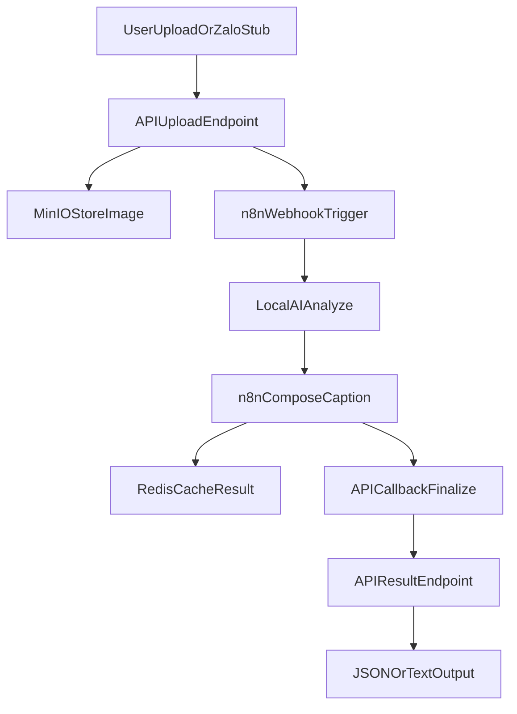

# Docker Compose MVP Implementation Plan

## Scope

Build a greenfield MVP in this repo with these runtime services:

- API service for web upload and callback responses
- n8n for orchestration
- MinIO for image storage
- Local AI service using OpenCV + MobileNet
- Redis for caching generated results

Channels in MVP:

- Web upload + REST API (fully working)
- Zalo webhook endpoints (stubbed contract for send/receive simulation)

## Target Project Structure

- [/home/leo/Projects/ngoinhapinterest/docker-compose.yml](/home/leo/Projects/ngoinhapinterest/docker-compose.yml)
- [/home/leo/Projects/ngoinhapinterest/.env.example](/home/leo/Projects/ngoinhapinterest/.env.example)
- [/home/leo/Projects/ngoinhapinterest/config.yaml](/home/leo/Projects/ngoinhapinterest/config.yaml)
- [/home/leo/Projects/ngoinhapinterest/services/api/](/home/leo/Projects/ngoinhapinterest/services/api/)
- [/home/leo/Projects/ngoinhapinterest/services/ai-local/](/home/leo/Projects/ngoinhapinterest/services/ai-local/)
- [/home/leo/Projects/ngoinhapinterest/infra/n8n/](/home/leo/Projects/ngoinhapinterest/infra/n8n/)
- [/home/leo/Projects/ngoinhapinterest/docs/](/home/leo/Projects/ngoinhapinterest/docs/)

## Implementation Steps

1. **Compose foundation**
   - Define `api`, `ai-local`, `n8n`, `minio`, `redis`, and optional `minio-init` in [docker-compose.yml](/home/leo/Projects/ngoinhapinterest/docker-compose.yml).
   - Add healthchecks, shared network, volumes, startup ordering, and env wiring.
   - Enforce config strategy: secrets/API keys from `.env`; non-secret runtime settings from `config.yaml`.
   - Expose only essential ports (API, n8n UI, MinIO UI/S3).

2. **API service (simple, non-over-split code)**
   - Build one lightweight app with straightforward routes:
     - `POST /upload` (multipart image)
     - `GET /result/:id`
     - `POST /webhooks/zalo/incoming` (stub)
     - `POST /webhooks/zalo/outgoing` (stub for testing)
   - Keep business flow in a small number of modules/files (avoid tiny helper functions):
     - Upload image to MinIO
     - Trigger n8n webhook with image metadata
     - Read/write Redis cache
     - Return JSON output matching MVP architecture format.

3. **Local AI service**
   - Implement a single HTTP endpoint `POST /analyze` that accepts image URL/object key.
   - Use OpenCV for dominant color extraction and MobileNet for top object label.
   - Return normalized payload `{ object, colors, confidence, captionDraft }`.
   - Keep logic simple and linear in one main processing flow.

4. **n8n workflow**
   - Add importable workflow JSON under [infra/n8n/](/home/leo/Projects/ngoinhapinterest/infra/n8n/):
     - Webhook trigger from API
     - Fetch object from MinIO (or pass URL)
     - Call local AI service `/analyze`
     - Compose final product caption text
     - Save response to Redis
     - Callback API endpoint to finalize result record.
   - Include one example test payload for manual replay.

5. **Output contracts and caching**
   - Standardize response schema to match [MVP Architecture.md](/home/leo/Projects/ngoinhapinterest/MVP%20Architecture.md):
     - `product_name`, `condition`, `size`, `price`, `colors`, `caption`
   - Add Redis TTL-based cache keyed by image hash/object key to avoid re-processing duplicates.

6. **Developer experience and runbook**
   - Add `.env.example` with API keys and secret values only.
   - Add `config.yaml` for non-secret configs (service ports, bucket names, TTL defaults, feature toggles).
   - Add startup/run instructions and curl test commands in [README.md](/home/leo/Projects/ngoinhapinterest/README.md).
   - Add troubleshooting notes for model download, MinIO bucket creation, and n8n workflow import.

## Runtime Flow

## Acceptance Criteria

- `docker compose up` starts all services cleanly.
- Uploading an image returns a request ID and later a completed caption/result payload.
- Repeat upload of same image hits Redis cache.
- n8n workflow is importable and executable without manual code edits.
- Zalo webhook stub endpoints accept payloads and return deterministic mock responses.
- README provides a complete local run + test path in under 10 minutes.

## Risks and Mitigations

- **Model/image libs are heavy**: use slim base images and pre-download model at build/start.
- **n8n-MinIO auth friction**: provide explicit env defaults and a startup checklist.
- **Asynchronous orchestration timing**: return request ID first, poll `/result/:id` for completion.
